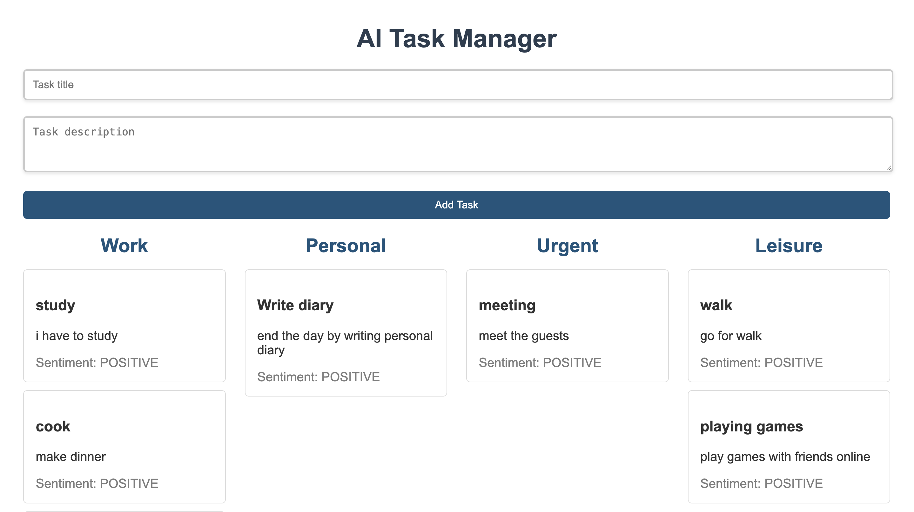

# AI-Task Manager

## Overview

The AI Task Manager is a simple web application designed to help users manage their tasks effectively. Users can add tasks, which are categorized automatically by AI, and view them organized by category.

## Features

- **Task Entry**: Users can input task titles and descriptions.
- **AI-Powered Categorization**: Tasks are categorized into four predefined categories: Work, Personal, Urgent, and Leisure.
- **User-Friendly Interface**: A clean and responsive design for easy task management.
- **Visual Organization**: Tasks are displayed in a grid format, categorized by their type.

## Technologies Used

- **Frontend**: HTML, CSS, JavaScript
- **Framework**: React.js
- **Styling**: CSS for styling the components
- **AI Integration**: Utilizes a machine learning model to categorize tasks automatically using the Hugging Face Transformers library.

## Demo
 
